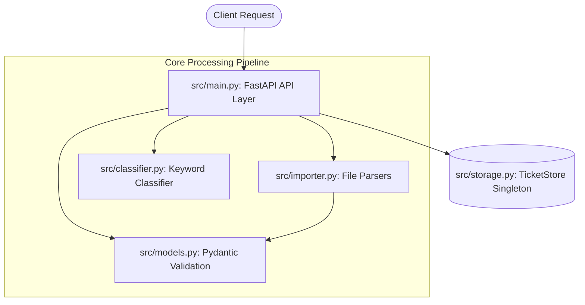
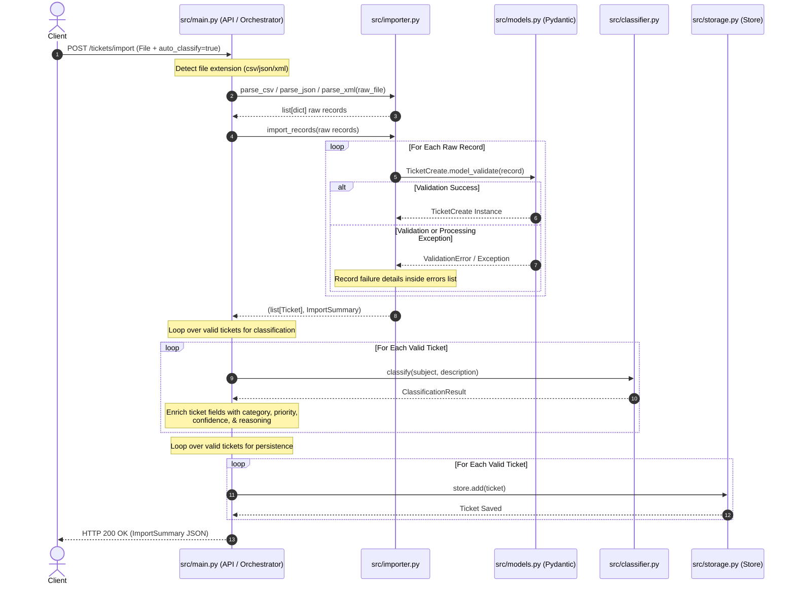

# ARCHITECTURE.md — System Design Documentation

This document provides a high-level technical overview of the Customer Support Ticket Management System's architecture, design decisions, and core trade-offs. This is intended for Technical Leads evaluating the system's structural integrity, performance thresholds, and deployment risks.

---

## 1. High-Level System Architecture

The system is designed as a single-process, monolithic REST API built using Python 3.13, FastAPI, and Pydantic v2. It eliminates external infrastructure dependencies by maintaining an ephemeral, in-memory datastore.

### Component Relationship Flowchart

### Component Descriptions

* **`src/main.py` (API Layer & Orchestrator)**: Acts as the entry point, routing mechanism, and core workflow orchestrator. It exposes 7 endpoints directly on the core app instance, managing HTTP transaction lifecycles, parsing multipart form payloads, evaluating query flags (such as `auto_classify`), and driving multi-step processing loops (such as calling the classifier and datastore sequentially during bulk imports).
* **`src/models.py` (Data Models & Validation)**: Formulates the system’s domain types via Pydantic v2 enums and models. It executes structural and type compliance validation, applying custom business constraints (e.g., non-blank validation for names and IDs, email string syntax validation, and character length bounds).
* **`src/importer.py` (Bulk Importer)**: Houses specialized text parsers for CSV (`utf-8-sig` handling), JSON, and XML structures. It normalizes distinct serializations into consistent dictionary layouts and coordinates an independent, record-by-record validation loop, returning validated objects and summaries without side effects.
* **`src/classifier.py` (Auto-Classifier)**: Implements deterministic, algorithmic rule sets to evaluate text strings. It isolates string matches, computes normalized relevance densities across multiple categories, establishes multi-tiered priority selections, and forms human-readable logs of execution logic.
* **`src/storage.py` (Data Persistence Layer)**: Hosts the `TicketStore` class, instantiated as a module-level global singleton (`store`). It acts as an in-memory document container using a dictionary collection mapped by unique string keys.

---

## 2. Non-Trivial Data Flow

The following sequence diagram outlines the transaction boundaries and component interactions during a bulk file import execution. Note that parsing/validation, auto-classification, and persistence are executed by `main.py` as three separate, sequential passes over the dataset.

### Bulk Import with `auto_classify=true`

---

## 3. Design Decisions and Trade-Offs

### Ephemeral In-Memory Storage vs. Persistent Database

* **Decision**: The application stores all data inside a standard Python dictionary (`TicketStore`), with no database connection layer, ORM mapping, or file-system serialization.
* **Trade-Off**: This approach provides high execution speeds and removes external infrastructure overhead, enabling clean isolation for unit testing. However, it completely lacks durability—all data is lost on a process crash or service restart. It is strictly limited to single-process deployments, as it cannot synchronize state across horizontal application instances.

### Concurrency Isolation via Single Global Lock

* **Decision**: Mutation methods (`add`, `update`, `delete`, `clear`) inside `TicketStore` are wrapped in a single `threading.Lock()`, while query operations (`get`, `list`) read directly from memory without acquiring a lock.
* **Trade-Off**: The global write lock protects the system from internal memory corruption during concurrent writes, fulfilling test criteria for simultaneous transactions (such as 20 parallel creation threads). However, reads are not strictly serialized against writes. This trade-off balances speed against absolute read consistency and can lead to write-locking contention under high-throughput request loads.

### Algorithmic Keyword Classification vs. Machine Learning Models

* **Decision**: Classification uses deterministic string substring matching and a basic scoring calculation ($hits / total\ keywords$). It falls back to default values when no keywords are found.
* **Trade-Off**: This design eliminates the memory overhead, cold-start latency, and CPU/GPU requirements of traditional ML frameworks. It runs efficiently within microsecond timeframes. The trade-off is limited linguistic intelligence—it relies on exact substring patterns, cannot interpret context or negation (other than explicitly defined rules, such as omitting `"urgent"` from the urgent keyword list), and requires manual updates to the keyword list to refine categorization accuracy.

### Mutability Constraints on Lifecycles (`resolved_at`)

* **Decision**: The `resolved_at` timestamp is written exactly once when a ticket’s status transitions to `resolved`. It remains fixed even if the ticket status is subsequently moved back to an open state.
* **Trade-Off**: This logic ensures an unalterable record of initial resolution speed for analytical reporting. However, it does not record operational real-world edge cases, such as tickets that are reopened and resolved multiple times.

### Scope of Manual Override Protection

* **Decision**: Manual updates (`PUT`) that define an explicit `category` or `priority` overwrite auto-classified values and are protected against subsequent implicit reclassification from downstream unrelated `PUT` actions.
* **Trade-Off**: This prevents system automation from silently discarding manual corrections during routine data updates. However, this protection is scoped strictly to implicit actions; explicitly invoking the dedicated auto-classify endpoint (`POST /tickets/{ticket_id}/auto-classify`) will bypass the lock and clobber manual adjustments.

---

## 4. Security and Performance Considerations

### Security Vulnerabilities and Operational Risk

Because the system was built for a limited assignment scope, several standard production security controls are missing:

* **Authentication/Authorization**: The system features no identity verification layer, permission checking, or client separation. Anyone with network access to the API can read, alter, or delete any ticket record.
* **Input Sanitization**: Input validation is limited to structural and data type checks managed by Pydantic. The system does not sanitize incoming text fields for Cross-Site Scripting (XSS) or injection attacks. This places the responsibility of sanitizing data entirely on any consuming user interface or downstream client.
* **Rate Limiting**: The system does not limit request velocity. It is vulnerable to resource exhaustion from automated attacks or poorly configured API clients, particularly on CPU-heavy endpoints like bulk file importing or text classification.

### Performance Profile and Horizontal Scaling Constraints

Performance benchmarks reveal a clear division between network/routing operations and core processing logic:

* **Execution Benchmarks**:
* **Network Layer Transaction**: Full HTTP round trips through FastAPI (`POST /tickets` with validation and storage) take approximately **2.8ms to 11ms** per call under benchmark loads.
* **Core Computation Unit**: Isolated utility components execute in microsecond intervals (**1µs to 10µs**), including data parsing (`parse_csv`, `parse_json`, `parse_xml`) and keyword scoring analysis (`classify`).

* **Concurrency Limits**: The single-process application successfully handles 20 concurrent creation requests and 50 simultaneous read operations under load test conditions. However, because the system relies on an in-memory dictionary global singleton, it **cannot scale horizontally** across multiple containers or servers without losing data consistency. This architecture restricts the system's capacity to a single process on a single machine.