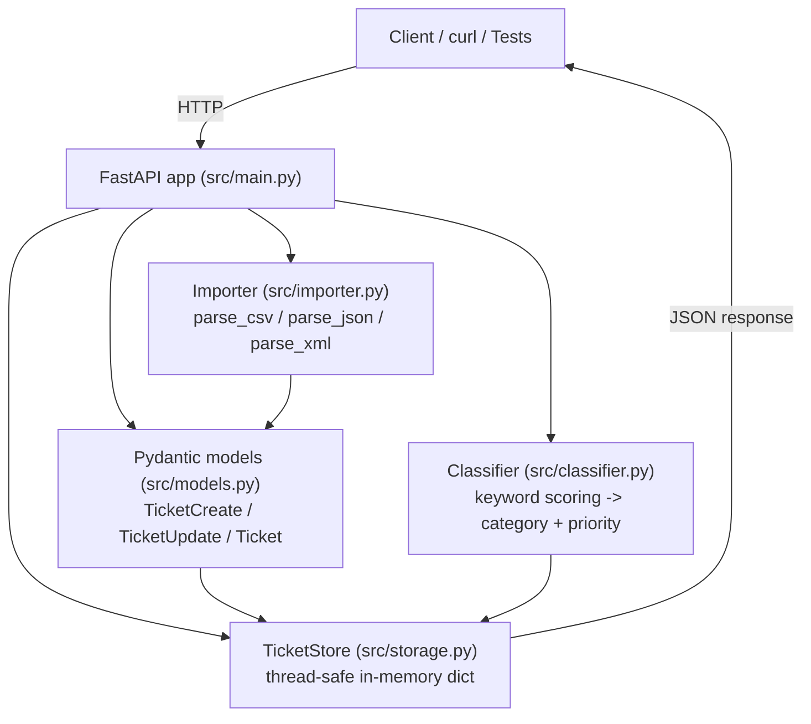

# 🎧 Customer Support Ticket Management System

> **Student Name**: Petro Moroz
> **Date Submitted**: 18.06.2026
> **AI Tools Used**: Claude Code, ChatGPT, Gemini, Copilot

---

## 📋 Project Overview

A REST API for managing customer support tickets, built with **FastAPI** and an in-memory thread-safe store. It supports:

- **CRUD operations** on tickets, plus **bulk import** from CSV, JSON, and XML files
- **Auto-classification** of tickets into a category and priority using keyword-based scoring, with a confidence score and human-readable reasoning
- **Filtering** ticket listings by category, priority, and status (combinable)
- A **161-test suite** (unit, edge-case, integration, and performance) achieving **100% line coverage**

### Key Features

| Feature | Details |
|---|---|
| Ticket CRUD | Create, read, update, delete via REST endpoints |
| Bulk import | CSV / JSON / XML parsers, per-record validation, partial-success summary |
| Auto-classification | 6 categories, 4 priority levels, confidence score (0–1), matched-keyword reasoning |
| Manual override | Classification fields can be overwritten via `PUT`; unrelated updates don't reclassify |
| Filtering | `GET /tickets` supports `category`, `priority`, and `status` query params together |
| Validation | Pydantic v2 models enforce email format, string length bounds, and enum values |

---

## 🏗️ Architecture



**Request flow for a single ticket creation:**

1. Client `POST /tickets` with a JSON body.
2. FastAPI validates the body against `TicketCreate` (email format, length bounds, enums).
3. A `Ticket` is built (UUID, timestamps assigned).
4. If `auto_classify=true`, the classifier scores the subject/description and writes back category, priority, confidence, and reasoning.
5. The ticket is stored in the thread-safe in-memory store and returned to the client.

Bulk import follows the same path per-record, after parsing the uploaded file with the format-specific parser, and returns an `ImportSummary` (total / successful / failed / errors).

---

## ⚙️ Installation & Setup

**Requirements:** Python 3.13+

```bash
cd homework-2

# create & activate a virtual environment (optional but recommended)
python -m venv venv
venv\Scripts\activate        # Windows
# source venv/bin/activate   # macOS/Linux

# install dependencies
pip install -r requirements.txt
```

### Run the API server

```bash
uvicorn src.main:app --reload
```

The API is then available at `http://127.0.0.1:8000`, with interactive docs at `http://127.0.0.1:8000/docs`.

---

## ✅ Running the Tests

```bash
pytest
```

This runs the full suite (unit, edge-case, integration, performance) and prints:
- A coverage table (configured in `pytest.ini` to cover `src/`)
- An HTML coverage report written to `docs/coverage/index.html`
- Benchmark timings for the performance-tagged tests

Run a single file or group:

```bash
pytest tests/test_ticket_api.py -v
pytest tests/test_integration.py tests/test_performance.py -v
```

See [TESTING_GUIDE.md](TESTING_GUIDE.md) for the full test pyramid, fixture locations, and a manual testing checklist.

---

## 📁 Project Structure

```
homework-2/
├── src/
│   ├── main.py          # FastAPI app and route handlers
│   ├── models.py         # Pydantic models, enums (Category, Priority, Status, Source, DeviceType)
│   ├── storage.py        # Thread-safe in-memory TicketStore
│   ├── importer.py       # CSV / JSON / XML parsers + import_records()
│   └── classifier.py     # Keyword-based auto-classification
├── tests/
│   ├── conftest.py             # Shared fixtures (client, payloads, fresh_store)
│   ├── test_ticket_api.py      # API endpoint tests
│   ├── test_ticket_model.py    # Pydantic model validation tests
│   ├── test_import_csv.py      # CSV parsing tests
│   ├── test_import_json.py     # JSON parsing tests
│   ├── test_import_xml.py      # XML parsing tests
│   ├── test_categorization.py  # Classifier tests
│   ├── test_integration.py     # End-to-end workflow tests
│   ├── test_performance.py     # Benchmarks + concurrency tests
│   ├── test_edge_cases.py      # Uncovered-branch / boundary tests
│   ├── test_review_items.py    # Tests added from code review feedback
│   └── fixtures/               # Sample CSV/JSON/XML data (valid + invalid)
├── docs/
│   ├── coverage/         # Generated HTML coverage report
│   └── screenshots/      # test_coverage.png and other screenshots
├── sample_tickets.csv    # 50 sample tickets
├── sample_tickets.json   # 20 sample tickets
├── sample_tickets.xml    # 30 sample tickets
├── invalid_tickets.*     # Negative-test fixtures (bad email, missing fields, etc.)
├── requirements.txt
├── pytest.ini
└── README.md
```

---

## 📚 Further Documentation

- [API_REFERENCE.md](API_REFERENCE.md) — endpoint reference with request/response examples and curl commands
- [ARCHITECTURE.md](ARCHITECTURE.md) — component breakdown, sequence diagrams, design decisions
- [TESTING_GUIDE.md](TESTING_GUIDE.md) — test pyramid, fixtures, manual testing checklist, benchmark results

<div align="center">

*This project was completed as part of the AI-Assisted Development course.*

</div>
