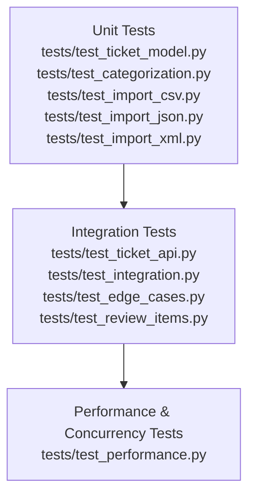

# TESTING_GUIDE.md — Customer Support Ticket Management System

## 1. Test Pyramid



- **Base (Unit tests):** Validate models, classifier, and import parsers in isolation.  
- **Middle (Integration tests):** End-to-end workflows, API CRUD, edge cases, review-driven scenarios.  
- **Top (Performance/Concurrency):** Stress and benchmark tests ensuring thread-safe in-memory store behavior.

---

## 2. Running Tests

- **Run full suite with coverage:**
  ```bash
  pytest --cov=src --cov-report=term-missing --cov-report=html:docs/coverage
  ```

- **Run a single test file:**
  ```bash
  pytest tests/test_ticket_api.py
  ```

- **Run a single test class:**
  ```bash
  pytest tests/test_ticket_api.py::TestCreateTicket
  ```

- **Run a single test function:**
  ```bash
  pytest tests/test_ticket_api.py::TestCreateTicket::test_returns_201_with_uuid
  ```

- **View HTML coverage report:**
  Open `docs/coverage/index.html` in a browser (generated automatically).

---

## 3. Sample Test Data Locations

- **tests/fixtures/** — reusable sample and invalid tickets for unit/integration tests.  
- **sample_tickets.csv** — 50 valid rows for bulk import testing.  
- **sample_tickets.json** — 20 valid records for JSON import testing.  
- **sample_tickets.xml** — 30 valid records for XML import testing.  
- **invalid_tickets.csv/json/xml** — deliberately malformed records for negative testing.

---

## 4. Manual Testing Checklist

QA engineers can validate endpoints manually using curl or Postman:

- [ ] **Create a ticket** (`POST /tickets`) with valid payload.  
- [ ] **Bulk import CSV/JSON/XML** (`POST /tickets/import`) with each format.  
- [ ] **Trigger auto-classify** (`POST /tickets/{id}/auto-classify`) and confirm category/priority/confidence/reasoning fields.  
- [ ] **Manual override classification** (`PUT /tickets/{id}` with explicit category/priority).  
  - *Note: Once overridden, classification is not re-run on unrelated updates — intentional behavior.*  
- [ ] **Filter tickets** (`GET /tickets?category=...&priority=...&status=...`) with combined filters (AND semantics).  
- [ ] **Full status lifecycle:** new → in_progress → waiting_customer → resolved → closed.  
  - *Note: `resolved_at` is set only the first time status becomes "resolved" and never cleared — expected behavior.*  
- [ ] **Delete ticket** (`DELETE /tickets/{id}`) and confirm subsequent `GET` returns 404.  
- [ ] **Invalid file format upload** (`POST /tickets/import` with `.txt`) → expect 400 with `"Unsupported file format"`.  
- [ ] **Malformed record in bulk import** → expect 200 response with `failed` count incremented and error details in `errors`.

---

## 5. Performance Benchmarks

| Group       | Test/Operation                        | Timing (per call) | Notes |
|-------------|---------------------------------------|-------------------|-------|
| **http**    | Bulk ticket creation via FastAPI       | ~2.8–11 ms        | Full HTTP round-trip including validation + storage |
| **parsing** | Classifier (`classify`)               | 1–10 µs           | Pure function execution |
| **parsing** | CSV/JSON/XML parsing                   | 1–10 µs           | Format-specific parser speed |

- **http group:** Measures end-to-end latency through FastAPI, validation, and in-memory store.  
- **parsing group:** Micro-benchmarks of classifier and parsers, isolated from HTTP overhead.

---

## 6. Architecture Note

Because this system uses a **single-process, in-memory store guarded by a lock**, concurrency tests (20 simultaneous creates, 50 simultaneous reads) succeed without corruption. Data is lost on restart — persistence is intentionally out of scope.

---

## 7. See Also

- **API_REFERENCE.md** — exact request/response shapes for manual testing.  
- **ARCHITECTURE.md** — rationale behind in-memory design and concurrency model.